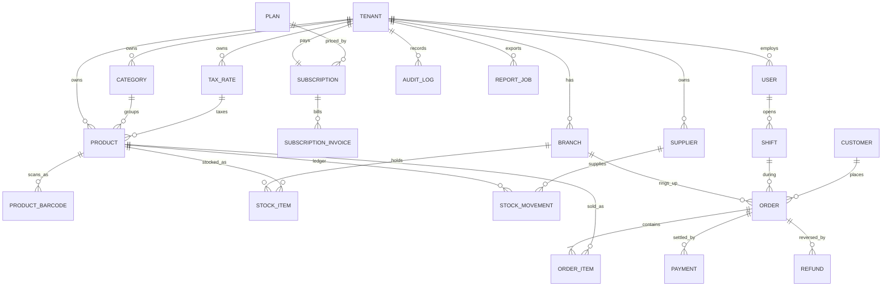

# Data model — Step 1

22 tables, single database, shared schema, row-level isolation on `tenant_id`.

## Why shared-schema over schema-per-tenant

| | Shared schema + `tenant_id` | Schema per tenant |
|---|---|---|
| Onboarding a shop | INSERT one row | Run DDL, ~22 CREATE TABLEs |
| 5 000 tenants | One set of tables | 110 000 tables, `pg_catalog` bloat, slow `\dt`, slow autovacuum |
| Migrations | One `alembic upgrade` | Loop over N schemas, partial-failure recovery |
| Cross-tenant reporting (MRR, churn) | Plain aggregate | UNION over N schemas |
| Isolation strength | Enforced (three layers, below) | Stronger by default |

Shared schema wins on every axis a SaaS POS cares about; the isolation gap is
closed by defence in depth rather than by hoping every query has a WHERE clause.

## Three layers of tenant isolation

1. **Middleware** — resolves the tenant from the JWT claim (and cross-checks
   the subdomain), sets it in a `ContextVar`. `tenant_id` is *never* read from
   a request body or query string.
2. **Session filter** — a SQLAlchemy `before_execute` event appends
   `WHERE tenant_id = :current_tenant` to every SELECT/UPDATE/DELETE against a
   `TenantMixin` table, and stamps it on every INSERT. A forgotten filter in a
   handler cannot leak data.
3. **Postgres RLS** — the app connects as a non-superuser role with
   `FORCE ROW LEVEL SECURITY`. Even raw SQL, a Celery task, or a psql session
   using the app role sees only the current tenant. This is the layer that
   holds when the other two have bugs.

```sql
-- applied per tenant-owned table by an Alembic migration
ALTER TABLE products ENABLE ROW LEVEL SECURITY;
ALTER TABLE products FORCE ROW LEVEL SECURITY;
CREATE POLICY tenant_isolation ON products
  USING (tenant_id = current_setting('app.current_tenant', true)::uuid)
  WITH CHECK (tenant_id = current_setting('app.current_tenant', true)::uuid);
```

Each request/task issues `SET LOCAL app.current_tenant = '<uuid>'` at the start
of its transaction. `SET LOCAL` dies with the transaction, so a pooled
connection cannot carry one tenant's context into the next tenant's request.

`users` and `audit_logs` are the deliberate exceptions: `tenant_id` is nullable
there because platform staff and platform-level events belong to no shop. On
`users` that exception is pinned down by a CHECK constraint —
`SUPER_ADMIN` ⟺ `tenant_id IS NULL` — rather than left to convention.

## Required extensions

```sql
CREATE EXTENSION IF NOT EXISTS pg_trgm;    -- fuzzy product-name search in the POS
CREATE EXTENSION IF NOT EXISTS btree_gin;  -- lets tenant_id sit in the GIN index
```

## Entity map



## Decisions worth flagging

**Stock lives in `stock_items`, never on `products`.** A quantity column on the
product row cannot represent multi-branch stock, and it turns every concurrent
checkout into a lost-update race. Checkout does
`UPDATE stock_items SET quantity = quantity - :qty WHERE ...` inside the order
transaction, so the row lock serialises two terminals selling the last unit.

**`stock_movements` is append-only.** On-hand quantity is always reconstructable
from the ledger, and shrinkage/waste is auditable. Rows are never updated.

**Order lines snapshot the product.** `product_name`, `sku`, `unit_price`,
`unit_cost`, `tax_rate` are copied into `order_items` at sale time. A receipt
reprinted a year later must show what the customer actually paid, and margin
reports must not shift when a purchase price changes. `product_id` is
`ON DELETE SET NULL` for the same reason.

**Money is `NUMERIC(14,2)`, quantity is `NUMERIC(14,3)`.** Never floats. Three
decimals on quantity because deli counters sell 0.250 kg.

**`orders.idempotency_key` is unique.** A tablet on flaky Wi-Fi retrying a
checkout must not create a second sale.

**Tax inclusivity is per rate, not global.** `tax_rates.is_inclusive` decides
whether the shelf price already contains tax — it changes the entire cart
calculation, so it is data, not a hardcoded assumption.

**Barcodes: one primary on `products`, extras in `product_barcodes`.** A
six-pack carton and a single can carry different EANs; `pack_size` lets one
scan of the carton add 6 units. Scanner lookup hits a partial unique index on
`(tenant_id, barcode)` — the hot path of the entire POS.

**No product variants in v1.** Size/colour matrices would double the catalog
API surface. The extension point is a `product_variants` table taking over
`sku`/`barcode`/`price`/stock ownership; nothing in the current model blocks it.

**`shifts` (cash drawer sessions)** were not in the brief but reconciling
counted cash against expected cash is how a real shop catches till shortfalls.
A partial unique index enforces one open shift per cashier per branch.

**`subscriptions.unit_amount` is frozen at subscribe time**, so raising a plan's
list price does not silently re-bill existing tenants. MRR normalises yearly
plans to a monthly figure.

---

# Step 2 — API, authentication, tenancy

## Corrections to Step 1, found by testing

**`users` was outside both isolation layers.** Its `tenant_id` is nullable
(platform staff belong to no shop), and both the ORM filter and the RLS
migration keyed off the NOT NULL `TenantMixin`. The staff-listing endpoint duly
returned another shop's employees — caught by
`test_staff_listing_is_scoped_to_the_callers_shop`. Fixed with a second mixin,
`OptionalTenantMixin`, that both layers now recognise. `users`,
`refresh_tokens` and `audit_logs` use it.

**The unique index on `pin_hash` was decorative.** Argon2 is salted, so two
cashiers with PIN 1234 produce different hashes and the constraint never fires.
Removed. PIN login now identifies the user first (tap an avatar) and then
verifies — one hash comparison instead of a scan over every cashier, which
also keeps it fast as staff count grows.

## How the three layers actually interlock

The ORM filter reads a **ContextVar**; the RLS policy reads a **transaction
GUC**. Changing one without the other is the subtle failure here — it showed up
as signup being rejected by its own RLS policy, because `tenant_scope()` moved
the Python context while the database still had an empty tenant. There is now
exactly one supported way to re-scope a live session,
`session_tenant_scope()`, which moves both together.

Authentication is the genuine exception: logging in must read `users` and write
`refresh_tokens` *before* any tenant is known. Rather than leave those tables
unprotected, the policy accepts one narrowly named GUC, `app.auth_lookup`, set
only by `auth_lookup_scope()` around the credential lookup itself and restored
on exit. `test_auth_escape_hatch_is_off_by_default` asserts it is never left on.

## The role split that makes RLS real

PostgreSQL exempts superusers and table owners from row-level security. A
policy list that looks perfect in `pg_policies` does nothing at all if the API
connects as the owner. So there are two roles:

| Role | Used by | RLS applies |
|---|---|---|
| `pos` (owner) | Alembic migrations only | No — deliberately |
| `pos_app` | API, Celery workers | Yes; `NOSUPERUSER NOBYPASSRLS`, DML grants only |

`test_app_role_cannot_bypass_rls` fails the build if that ever regresses.

## Security side-effects must outlive the failure they record

Two bugs with one root cause: the failed-login counter and the token-reuse
revocation were both written into the request session, which rolls back when
the request raises its 401 — so lockout never engaged and a detected stolen
token was never actually revoked. Both now commit in their own transaction.

## Token design

- Access tokens carry `tid`; it is the **only** source of tenant identity the
  API trusts. Subdomain and request body cannot influence it.
- Cashier access tokens last 12h (a shift), admin tokens 30min.
- Refresh tokens are single-use and stored only as SHA-256 digests. Replaying a
  rotated token revokes the whole family — we cannot distinguish thief from
  victim, so both are signed out.
- `get_current_user` re-checks role and tenant against the database, so a token
  minted before a demotion does not keep the old powers.

## Verified

Against PostgreSQL 16 in Docker: 5 migrations apply from an empty database,
`alembic check` reports no model/migration drift, and 20 tests pass — 8 asserting
database-level isolation, 12 covering the auth flows end-to-end through HTTP.

---

# Step 5 — Tenant admin panel

Inventory, employees, analytics and background report exports.

## A migration that only broke fresh databases

`0003_row_level_security` derived its table list from the *live* models via
`tenant_owned_tables()`. Adding `OrderCounter` in Step 4 therefore made a
historical migration try to `ALTER TABLE order_counters` three revisions before
that table exists.

Every developer machine was already past 0003 and kept working. Every *fresh*
database — CI, a new hire, the first `docker compose up` in Step 7 — failed.
That failure shape is the worst kind: invisible where you work, fatal where it
matters. The revision now pins its table list literally, because a migration is
a snapshot of history, not a view of the present. `tests/test_migrations.py`
rebuilds from empty and asserts no tenant-owned table ends up without a policy.

## Two bugs in one error handler

`exc.errors()` was passed straight into the 422 body. That did two bad things:

- **500 instead of 422.** Pydantic puts the original exception object in `ctx`
  for custom validators, and it is not JSON-serialisable. Every endpoint with a
  `field_validator` — signup slugs, report date ranges, PIN format, role
  checks — returned an internal error instead of a validation message.
- **It echoed the submitted value.** `input` carries the offending field's
  value, so a too-short password on `/auth/signup` came back in the response
  body, and from there into browser consoles and log aggregators.

Responses now carry `field`, `message`, `type` and nothing else.

## Plan limits, finally enforced

`plans.max_products` / `max_users` / `max_branches` have existed since Step 1
and gated nothing — a Basic tenant could create ten thousand products and the
only signal would be the bill never going up. `app/core/quotas.py` checks at
creation time (402 `quota_exceeded`), and `/analytics/usage` surfaces usage
*before* a ceiling is hit, because discovering a plan limit at the moment you
need to add a till is a bad way to find out.

## Cost is permission-gated at the source

`/catalog/products` feeds both the POS grid and the admin catalog table, so it
has to answer differently for the two audiences. `cost_price` and margin are
returned only to callers holding `PRODUCT_COST_READ` and are `null` otherwise —
a cashier's response never contains what the shop pays. Withholding it in the
UI would not be the same thing.

## Reports run out of band

A year of sales is not something to render inside an HTTP request. `POST
/reports` returns **202** with a job; a Celery worker generates the file and
fills in `file_url`. Five report types, CSV and PDF from the same row builders,
so the two formats cannot disagree.

- Money columns are quantised to exactly 2dp and quantities to 3dp. Postgres
  returns `NUMERIC(14,3) * NUMERIC(14,2)` as five decimals and
  `coalesce(sum(...), 0)` as a bare `0`, so an unquantised export printed
  "17.60000" beside "20.00" — which reads as a broken system whatever the
  arithmetic underneath.
- CSVs are written `utf-8-sig`; without the BOM Excel mangles accented product
  names.
- Downloads go through the authenticated API and are path-checked against the
  tenant's own directory, because an export holds a shop's entire trading
  history.
- Worker status updates commit on their own connection — a failure marker
  written inside the job's transaction would roll back with the failure it
  records, leaving the job stuck on "running" forever. Same trap as the login
  lockout counter in Step 2.

Verified with a real Redis and worker: all five types generate, and the tax
report cross-checks (zero-rated bakery £8.00 at 0.00 tax; 20%-inclusive drinks
£12.00 gross containing £2.00 tax).

---

# Step 6 — Super admin panel

Cross-tenant metrics, tenant control and plan management for the SaaS operator.

## Reading across shops, safely

Everything in `platform_service.py` deliberately does what the rest of the
codebase spends three layers preventing. Two things make that safe:

* every route sits behind the `PlatformAdmin` dependency, which needs a
  signature-verified `SUPER_ADMIN` token; and
* the RLS escape is a named GUC (`app.is_platform`) that `get_db` sets **only**
  for that verified principal.

The ORM tenant filter is a no-op here because a platform admin has no
`tenant_id` — so no `SKIP_TENANT_FILTER` is needed, and RLS is what actually
grants the wider view. The boundary runs one way: a platform admin can read
across shops but is not a member of any, so shop-scoped routes refuse them
(`test_platform_admin_cannot_use_shop_endpoints`).

A new `platform_scope()` helper makes cross-tenant writes explicit and
greppable. The bootstrap seed needed it — RLS correctly refused to insert a
NULL-tenant platform admin from an unscoped session.

## `.env` values that silently did nothing

`seed_super_admin` read `SUPER_ADMIN_EMAIL` via `os.getenv`. pydantic-settings
loads `.env` into the `Settings` object and **not** into the process
environment, so the documented variables were ignored and the seed always
skipped. Both now come through `Settings`.

## Money decisions the panel deliberately does not make for you

- **Trials are pipeline, not MRR.** Counting them as revenue is how a SaaS
  dashboard flatters itself. They are reported separately as
  `trial_pipeline_mrr`.
- **Assigning a plan does not end a trial.** Converting starts charging
  someone, so it is an explicit `activate` flag, off by default — an operator
  fixing a mis-selected tier must not bill a shop a fortnight early.
- **Editing a plan's price does not re-bill existing shops.** Subscriptions
  freeze `unit_amount` at signup precisely so a list-price change cannot
  silently increase what a shop already pays.
- **A downgrade never deletes data.** Moving a shop to a smaller plan leaves
  its products and staff intact; the quota guard simply refuses further
  additions until they are back under.
- **Plans are retired, not deleted.** Subscriptions reference them with
  `ON DELETE RESTRICT`, and a shop mid-term on a legacy tier still needs its
  plan row to resolve.
- **Closing a shop is a soft delete.** Its sales history is usually a legal
  record the operator must retain.

Yearly plans normalise to a monthly figure in SQL, so both cycles are
comparable: verified at £1,490/year → £124.17 MRR.

## Blocking takes effect immediately

`get_current_tenant` checks status on every request, so a suspended shop is cut
off on its very next call rather than whenever its tokens happen to expire —
and every staff session is revoked, so a till already open cannot keep trading.
The operator's reason is surfaced directly to the shop, so "why can't I sell?"
has an answer without a support ticket. Verified end to end: the suspended
shop's owner gets `403 tenant_inactive` with the reason, while other shops are
untouched.

## A test-isolation bug my own harness had

`conftest` truncated every table except `plans`, so one test retiring a tier
left it inactive for every test after it and broke signup platform-wide. Plans
are now truncated and re-seeded per test.
